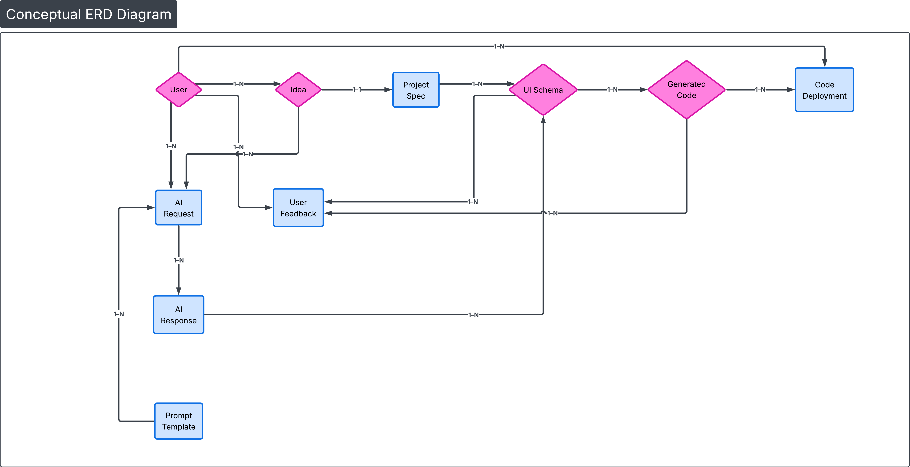
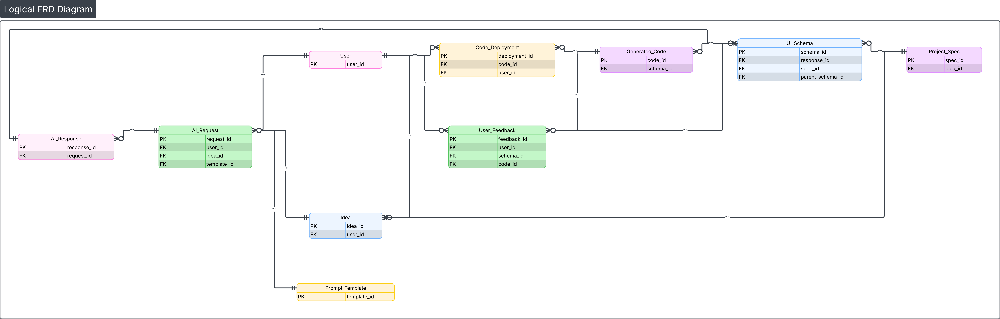

# AI Idea API

Node.js + Express + TypeScript backend API with PostgreSQL. Docker-based development setup.

## Database Schema

### Conceptual ERD



### Logical ERD



### Diagram


## Quick Start

### Prerequisites

- Docker & Docker Compose
- Git

### Setup

**1. Clone and navigate**

```bash
git clone <your-repository-url>
cd ai-idea-api
```

**2. Create `.env` file**

```bash
cat > .env << 'EOF'
# Server
PORT=3000
NODE_ENV=development

# Database
DB_HOST=postgres
DB_PORT=5432
DB_USER=postgres
DB_PASSWORD=postgres
DB_NAME=ai_idea_db

# Authentication
JWT_SECRET=your-secret-key-here
JWT_EXPIRES_IN=1d
EOF
```

**3. Start Docker Compose**

```bash
docker-compose up --build -d
```

**4. Import database schema**

```bash
docker cp database/schema.sql $(docker-compose ps -q postgres):/schema.sql
docker-compose exec -T postgres psql -U postgres -d ai_idea_db -f /schema.sql
```

**5. Verify**

```bash
# Check API is running
curl http://localhost:3000

# Check containers
docker-compose ps
```

## Development

### Install dependencies

```bash
npm install
```

### Run dev server (with hot-reload)

```bash
npm run dev
```

### Build for production

```bash
npm run build
npm start
```

## Common Commands

```bash
# View logs
docker-compose logs -f

# Stop containers
docker-compose down

# Reset database
docker-compose down -v
docker-compose up --build -d
docker cp database/schema.sql $(docker-compose ps -q postgres):/schema.sql
docker-compose exec -T postgres psql -U postgres -d ai_idea_db -f /schema.sql

# Access PostgreSQL directly
docker-compose exec postgres psql -U postgres -d ai_idea_db
```
